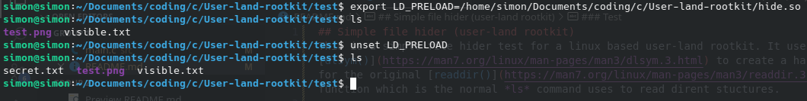

## User-land rootkit test
This is a simple user-land rootkit for linux which was created purely for educational purposes.

### Simple file hider module
This is a simple file hider test for a linux based user-land rootkit. It uses [dlsym()](https://man7.org/linux/man-pages/man3/dlsym.3.html) to create a handle for the original [readdir()](https://man7.org/linux/man-pages/man3/readdir.3.html) function which is the normal *ls* command uses to read dirent stuctures. 

The dirent structures represent the next directory entry in the dirp stream, and dirp is a pointer to a DIR structure which is an open directory stream.

If the value returned by the original readdir() function contains a substring of in this case "secret" it will skip the file/directory thereby hiding it from user view while running *ls* in a folder.

#### Loading the library
In order to load the custom library along side *ls* so that it uses this library instead of it's own readdir() we'll have to utilize **LD_PRELOAD**. This makes sure that our custom library with the modified readdir() is loaded before any other library when running *ls* in the terminal.

#### Compiling
To compile the module run the following command
```
gcc -fPIC -shared -o hide.so src/main.c -ldl
```

The compiler flags do as follows:
- *-fPIC* Is Position-Independant Code which tells the compiler to generate code that can be relocated at runtime without modifications. This is a requirement for building shared libraries.
   
- *-shared* Tells the compiler to produce a shared library file instead of an executable (.so)

- *-o* Just specifies the output file name. 

- *-ldl* Links the dynamic linking library **libdl** which is used for **dlsym()** in this case


#### Test
